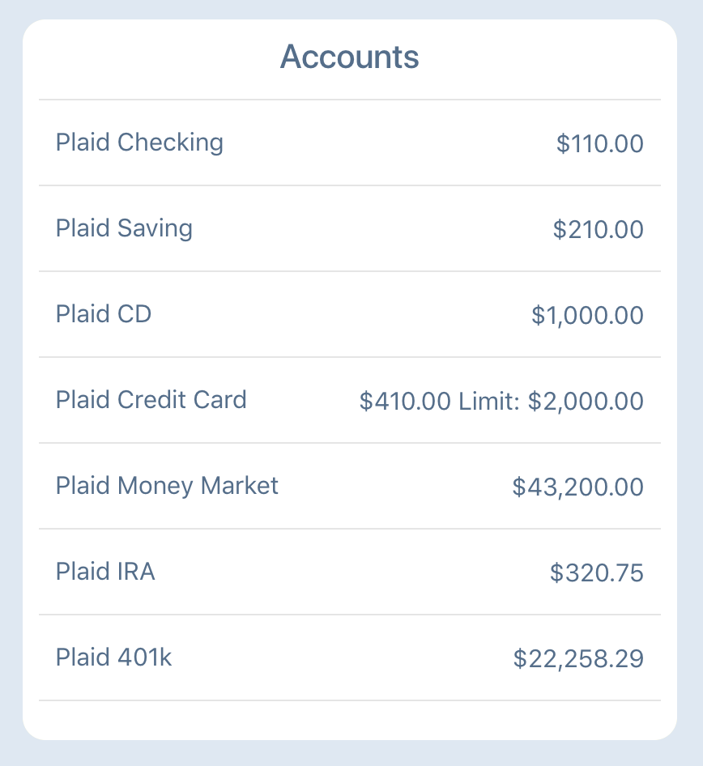

# Clarity Money Clone

## Introduction

This is the repo for the Flatiron School Mod 5 Project. Clarity Money Clone is a clone of https://claritymoney.com/. The app can help you take control of your finances. It can display your financial picture, and deliver insights to you — all in one place.


## Key Functionality 
- 

## Install Instructions

#### Backend (https://github.com/yli0607x/clarity_money_clone_backend)
```sh
$ git clone git@github.com:yli0607x/clarity_money_clone_backend.git
$ cd clarity_money_clone_backend
$ bundle install
$ rails s -p 4000
```

#### Frontend
```sh
$ git clone git@github.com:yli0607x/clarity_money_clone_front_end.git
$ cd clarity_money_clone_front_end
$ npm install 
$ npm start
```
## Technologies Used
- @material-ui/core: ^3.9.1,
- @material-ui/icons: ^3.0.2,
- plaid: ^2.10.0,
- prop-types: ^15.6.2,
- react: ^16.7.0,
- react-chartjs-2: ^2.7.4,
- react-dom: ^16.7.0,
- react-facebook-share-link: ^1.0.4,
- react-moment: ^0.8.4,
- react-number-format: ^4.0.6,
- react-plaid-link: ^1.0.3,
- react-redux: ^6.0.0,
- react-router-dom: ^4.3.1,
- react-text-mask: ^5.4.3,
- redux: ^4.0.1,
- redux-thunk: ^2.3.0,
- semantic-ui-react: ^0.84.0

## API Used
- Darksky
- Plaid
